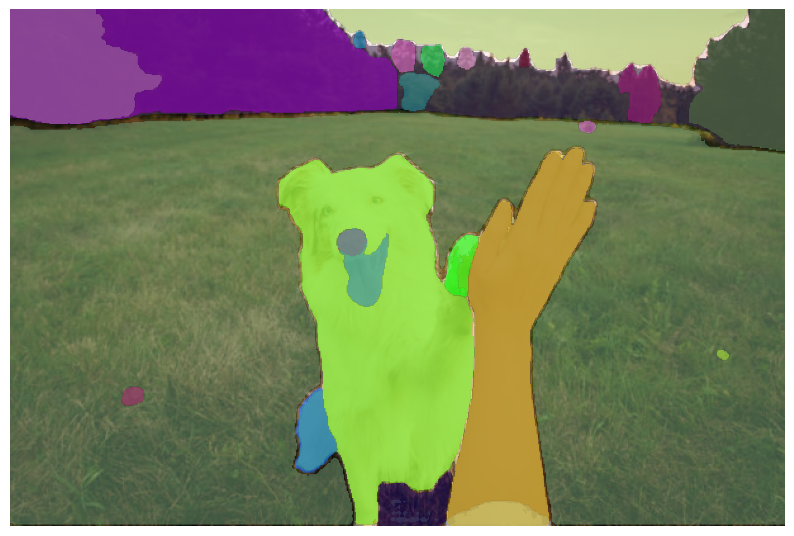
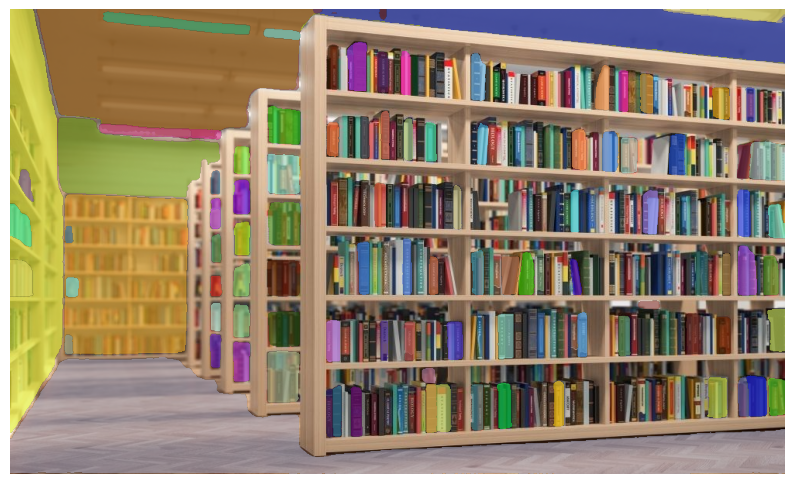
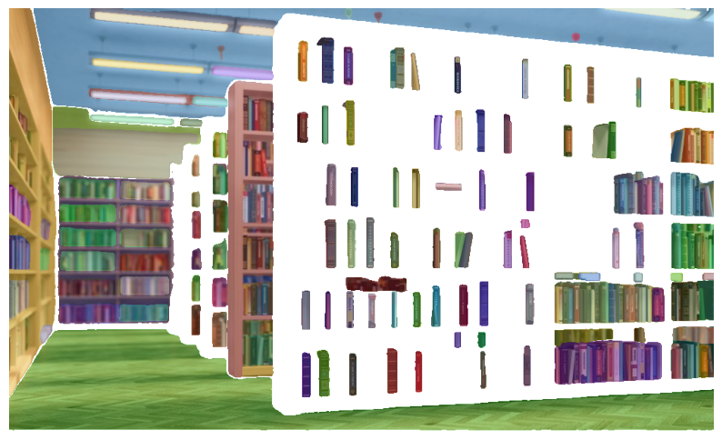
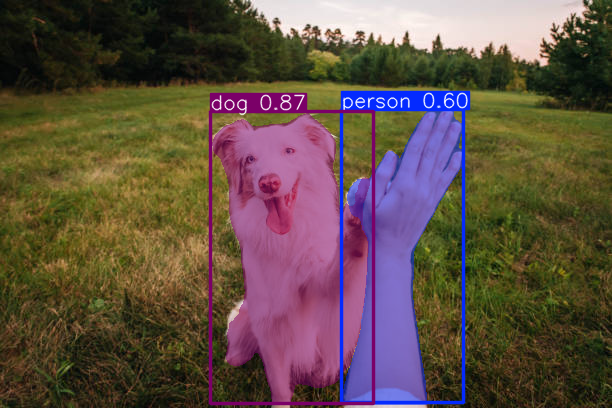

## Model Comparison

| Feature | MobileSAM | ViT-L (float16 quantized) |
|----------|------------|---------------------------|
| **Architecture** | Lightweight Mobile-ViT backbone | Full Vision Transformer (ViT-B) |
| **Model Type** | Compressed and optimized | Original SAM (Meta AI) |
| **ONNX Model Size** | ~50 MB | ~600 MB |
| **Speed (CPU)** | Very fast — ideal for real-time | Moderate — heavier compute load |
| **Model Load Time (CPU)** | ~3 seconds | ~15–20 seconds |
| **Memory Usage (RAM)** | ~3 GB | ~6–8 GB |
| **Segmentation Accuracy** | Good — slightly coarse edges | Excellent — fine-grained masks |
| **Prompt Encoder** | Same SAM prompt encoder | Same SAM prompt encoder |
| **Best Use Case** | Mobile, embedded, or low-spec systems | Desktop or high-precision offline segmentation |
| **ONNX Input Precision** | float16 | float16 |
| **Output Quality** | Balanced between speed and accuracy | Higher-quality segmentation masks |
| **Export Time (to ONNX)** | ~30 seconds | ~2 minutes |
| **Inference Runtime** | ~0.3–0.5 seconds per click | ~2-3 seconds per click |
| **Frameworks Used** | PyTorch + ONNXRuntime | PyTorch + ONNXRuntime |
| **Model Checkpoint** | `mobile_sam.pt` | `-` |

**Summary:**  
Use **MobileSAM** for fast, lightweight, and interactive segmentation — perfect for real-time and edge applications.  
Use **ViT-B** for higher segmentation precision where computational cost is acceptable.

---

## Visualization Comparison

| Model | Visualization | Description |
|--------|----------------|--------------|
| **MobileSAM** |  | Lightweight and fast — ideal for mobile and real-time use. (29 objects) |
| **ViT-B** |  | High accuracy and precision — suited for desktop or offline segmentation. (32 objects) |
| **MobileSAM** |  | Lightweight and fast — ideal for mobile and real-time use. (79 objects) |
| **ViT-B** |  | High accuracy and precision — suited for desktop or offline segmentation (102 objects). 
| **YOLO-v8-seg** |  | very -fast can be used in simple object detection and masking. |
| **Masked R-CNN** |  | very -fast can be used in simple object detection and masking. |
